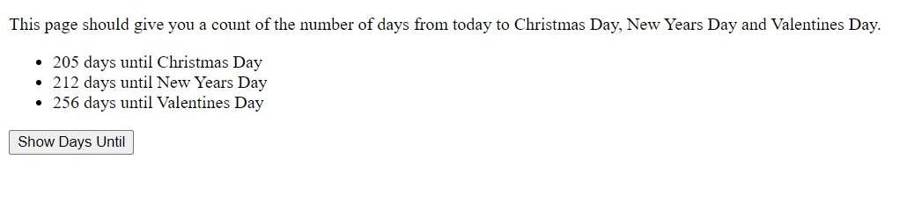

I can't believe how long this took me to figure out but I'm so glad it's finally worked! 
I tried a few different approaches but I couldn't quite get them to work out so I changed the code a lot since my first try. 

## First of all I changed the code to this:

$("#trigger").click(function(){
  var HolidayDates = new Date();
  var Christmas = new Date(2021,12,25)
  var NewYear = new Date(2022,01,01)
  var Valentines = new Date(2022,02,14)
  var CalcDaysUntil = parseInt((Valentines-HolidayDates)/(24*3600*1000));

  $("#days-until").append("<li>" + CalcDaysUntil.toString()+" days until Christmas</li>");
  $("#days-until").append("<li>" + CalcDaysUntil.toString()+" days until New Year</li>");
  $("#days-until").append("<li>" + CalcDaysUntil.toString()+" days until Valentines Day</li>");
})

However I then found it tricky to work in the .forEach to display each date of each holiday.

So I changed the method and used an Array instead that allowed me to target each item accordingly. 
I did a lot of research in the end because a bug was planted so that the math wouldn't be calculated correctly. What I thought would have taken me 
a couple of hours actually took me two days in all and that surprised me. It was getting the dates correct that took the time.
I learned a lot though including many different ways of solving this issue, however I didn't feel that the other methods displayed an
example of clean code at all and they were quite lengthy so I decided to stick with this approach.

## The final code ended up as this:

$("#trigger").click(function () {
  const holidayDates = [
    [new Date(2021,11,25), ('days until Christmas Day')], 
    [new Date(2022,0,01), ('days until New Years Day')], 
    [new Date(2022,1,14), ('days until Valentines Day')]];

  const today = new Date();
  
  holidayDates.forEach((item) => 
  {const calcDaysUntil = Math.ceil((item[0].getTime() - today.getTime()) / (1000 * 60 * 60 * 24));
   
    const countdownResult = `<li> ${calcDaysUntil} ${item[1]}</li>`;
    $("#days-until").append(countdownResult);
  });
});

I'll explain what each line of this code does step by step.
1. $("#trigger").click(function () { - This obviously triggers the function when the button is clicked that is in the HTML.
2. const holidayDates = [ - This holds the data of the holiday dates and description in an Array.
3. [new Date(2021,11,25), ('days until Christmas Day')], 
    [new Date(2022,0,01), ('days until New Years Day')], 
    [new Date(2022,1,14), ('days until Valentines Day')]]; - The Array itself.
4. const today = new Date(); - This gets the current date for today so the math logic knows to calculate starting from today.
5. holidayDates.forEach((item) => 
  {const calcDaysUntil = Math.ceil((item[0].getTime() - today.getTime()) / (1000 * 60 * 60 * 24));
    console.log(item) - This targets each item in the Array. The Math.ceil kept coming up in my research and many blogs explained that
    this makes sure the math rounds up the numbers correctly. That wasn't something I was very familiar with before. 
    The item[0].getTime() gets the data for the new dates, in other words, the holiday dates themselves.
    The today.getTime() gets the date today and calculates the number of days between the two dates.
    Then this math logic is used / (1000 * 60 * 60 * 24));. It divides the time difference of both dates since there are 
    1000 milliseconds in a day, 60 seconds in a minute, 60 minutes in an hour and 24 hours in a day (1000*60*60*24).
6. const countdownResult = `<li> ${calcDaysUntil} ${item[1]}</li>`; - This calls the countDownResult which contains the
days until the holiday arrives in calcDaysUntil, the item 0 and the item 1 which is the holiday description text. 
7. $("#days-until").append(countdownResult); - This then calls the id within the list and will display the result and show the 
executed code when the browser is opened. 

All in all, it was a great exercise and I learnt more than I thought I would.

